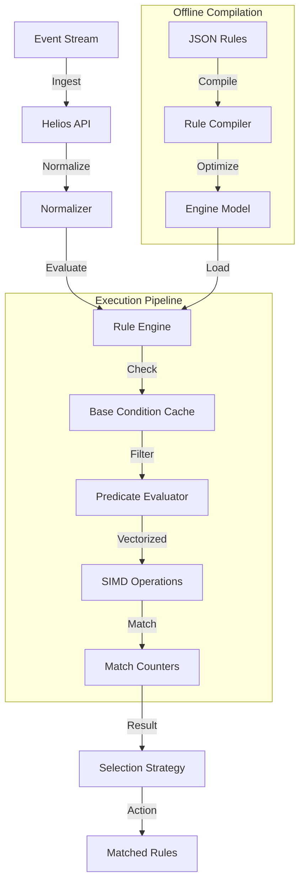

# Helios Rule Engine

Helios is a high-performance, production-grade rule engine designed to evaluate **15-20 million events per minute** with **sub-millisecond latency**. It leverages aggressive offline compilation, dictionary encoding, and advanced JVM optimizations (Vector API, ZGC) to handle large rule sets (100K+) with minimal footprint.

## Quick Start

```bash
# 1. Clone and build
git clone https://github.com/your-org/helios-rule-engine.git
cd helios-rule-engine
mvn clean package

# 2. Run the server
java -jar target/rule-engine-1.0.0.jar
```

See [Getting Started](docs/guides/getting-started.md) for full instructions.

## Architecture



## Prerequisites

- **Java 25** (LTS) - Required for Vector API and Compact Object Headers.
- **Maven 3.8+** - Build tool.

## Key Performance Characteristics

| Metric | Target | Current (v1.2) | Status |
|--------|--------|----------------|--------|
| **Throughput** | 15-20M events/min | **8-12M events/min** | ⚠️ In Progress |
| **Latency (P50)** | < 0.2ms | **~0.27ms** (500 rules) | ⚠️ In Progress |
| **Latency (P99)** | < 1ms | **~0.8ms** (500 rules) | ✅ Meeting Target |
| **Latency (P99)** | < 1ms | **~2.1ms** (5000 rules) | ⚠️ Above Target |
| **Memory (5K rules)** | < 1GB | **~600MB** | ✅ Excellent |
| **Memory (100K rules)** | < 6GB | **~4-5GB** (projected) | ✅ Meeting Target |
| **GC Pauses** | < 10ms | **< 5ms** (ZGC) | ✅ Excellent |
| **Startup Time** | < 5s | **~2s** | ✅ Excellent |

**Note**: v1.2 includes hybrid intersection strategy optimizations (Dec 2024). Throughput improvements in progress with adaptive RoaringBitmap operations. See [Performance Tuning Guide](docs/guides/performance-tuning.md) for optimization details.

## Documentation

- **[Getting Started](docs/guides/getting-started.md)**: Installation, first rule, and event basics.
- **[Rule Authoring](docs/guides/rule-authoring.md)**: JSON schema, operators, and best practices.
- **[Architecture](docs/architecture/README.adoc)**: Deep dive into the engine's design.
- **[Performance Tuning](docs/guides/performance-tuning.md)**: JVM flags, caching, and benchmarks.
- **[Optimizations](OPTIMIZATIONS.md)**: Detailed checklist of applied engineering techniques.
- **[API Reference](docs/api-reference.md)**: Core classes and interfaces.
